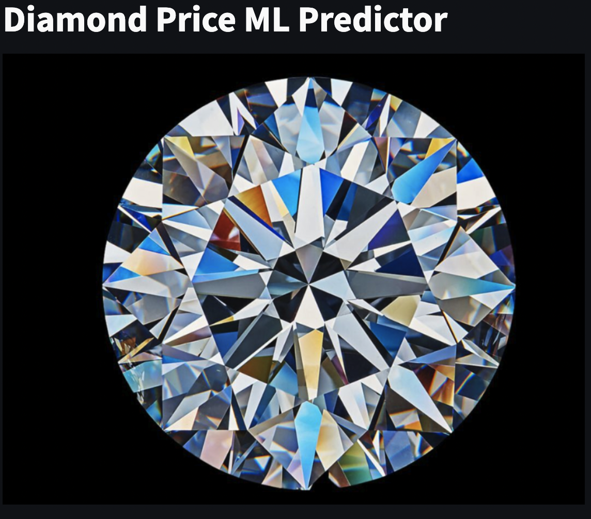
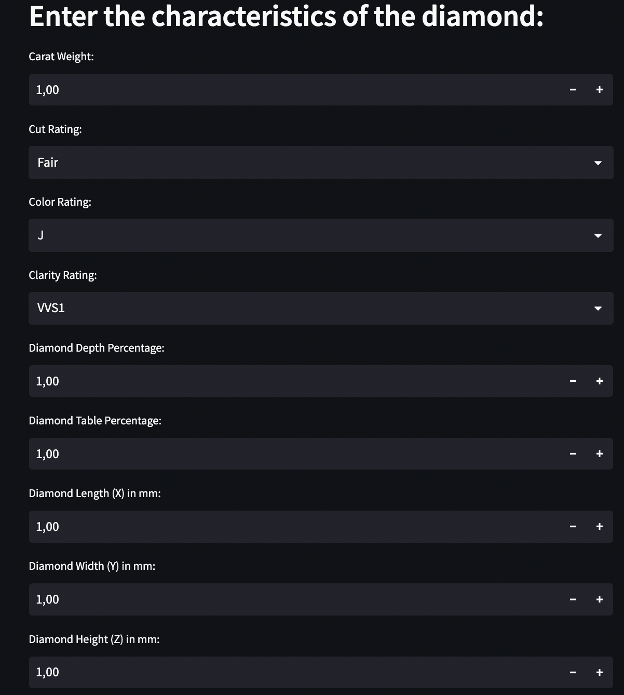
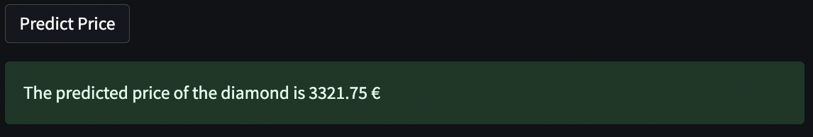

# Diamond Price ML Predictor App using Streamlit #


### Repository description ###

This repository serves as a comprehensive tutorial for developing a regression model that accurately predicts (R^2 ~= 99%)the price of diamonds. Additionally, it provides guidance on creating a user-friendly frontend application using Streamlit to make the model readily accessible to the public.


### Data Description ###

The data we will be using for this project is the [Diamonds](https://www.kaggle.com/datasets/shivam2503/diamonds) dataset, which is publicly available via Kaggle. It contains 53940 observations, and 10 features in the dataset.

### Tools ###

- **Streamlit** for creating a frontend application



Enter the charactericts of the diamond


Upon clicking the "Predict Price" button


## Usage

```
$ streamlit run streamlit.py
